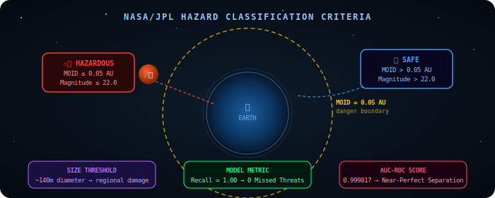
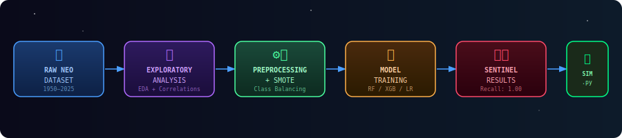
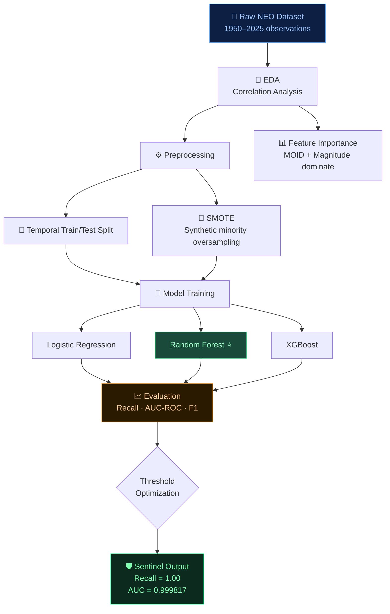
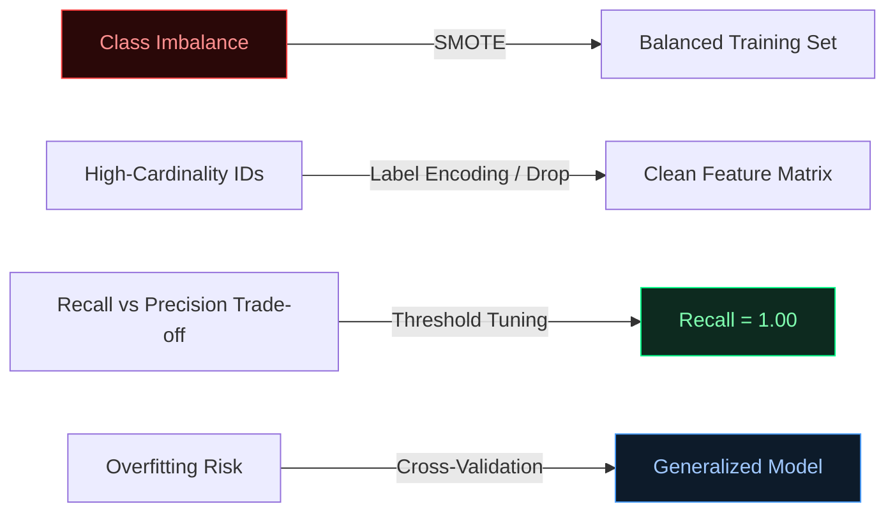

<div align="center">


<br/>


<br/>


</div>

---

## 🌌 Background: The Planetary Defense Mission

Our solar system is a cosmic shooting gallery. Among the millions of objects orbiting the Sun, **Near-Earth Objects (NEOs)**—specifically comets and asteroids—pose a unique challenge to Earth's safety. While most bypass our planet at safe distances, a select few are designated as **Potentially Hazardous Objects (PHOs)**.

Identifying these threats early using orbital mechanics is the **first line of planetary defense**.

---

## 🎯 What Makes an Object "Hazardous"?

<div align="center">
  
</div>

According to NASA/JPL CNEOS standards, hazardous classification is triggered by **two critical thresholds**:

| Criterion | Threshold | Physical Meaning |
|-----------|-----------|-----------------|
| 🔴 **Proximity (MOID)** | ≤ 0.05 AU | Orbit crosses Earth's neighborhood |
| 🟠 **Absolute Magnitude** | ≤ 22.0 | Object ≥ ~140m — causes regional devastation |

> **Why 140 meters?** An object of this size carries energy comparable to hundreds of nuclear warheads. The 1908 Tunguska event (~50–80m) flattened 2,000 km² of Siberian forest — a 140m+ object would be catastrophically worse.

---

## 🛠️ ML Pipeline

<div align="center">
  
</div>



---

## 📂 Dataset Description

The dataset spans observations from **1950 to 2025**, catalogued by NASA's Center for Near Earth Object Studies (CNEOS).

### Feature Categories

| Category | Features | Role |
|----------|----------|------|
| 🔵 **Physical Properties** | Absolute Magnitude, Est. Diameter | Primary hazard signals |
| 🟣 **Orbital Shape** | Eccentricity, Semi-Major Axis, Inclination | Trajectory characterization |
| 🟡 **Proximity Metrics** | MOID, Miss Distance | Direct proximity to Earth |
| 🟠 **Dynamics** | Relative Velocity, Orbital Period | Close-approach energy |
| 🔴 **Stability** | Jupiter Tisserand Invariant | Orbital family classification |
| ⚪ **Reliability** | Orbit Uncertainty, Determination Date | Data quality weighting |

### Class Imbalance

```
All NEOs: ████████████████████████████████████████  ~97% Safe
Hazardous: ██                                        ~3%  Hazardous
```

> Hazardous objects are statistically rare — raw training leads to a degenerate model that predicts "safe" for everything. Addressed via **SMOTE** and **class weighting**.

---

## 🤖 Models & Results

<div align="center">
  
</div>

### Performance Summary

| Model | Recall | AUC-ROC | False Negatives | Notes |
|-------|--------|---------|-----------------|-------|
| Logistic Regression | 0.87 | 0.960 | Several | Baseline |
| **Random Forest** ⭐ | **1.00** | **0.9998** | **0** | **Best Model** |
| XGBoost | 0.99 | ~0.998 | ~1 | Near-perfect |

### Why Recall is the North Star Metric

```
🚨  A FALSE NEGATIVE = A MISSED ASTEROID
    → No warning system deployed
    → No evacuation ordered
    → Catastrophic, irreversible outcome

✅  A FALSE POSITIVE = An unnecessary alert
    → Scientists double-check
    → Harmless — we can verify and stand down
```

> Minimizing **False Negatives** is non-negotiable in planetary defense. The Random Forest achieved **Recall = 1.00** with **zero missed threats** on the test set.

---

## 📁 Repository Structure

```
SpaceCode-26/
│
├── 📓 PS_3-2.ipynb                 ← End-to-end ML pipeline (EDA → Results)
├── 🐍 Simulator.py                 ← Interactive asteroid trajectory simulator
├── 📄 PS-3 Technical Report.pdf    ← Strategy document: imbalance + interpretation
├── 📄 SpaceCode.pdf                ← Project overview & methodology
├── 📄 SpaceCode -1.pdf             ← Extended analysis report
└── 📖 README.md
```

---

## 🚀 Quickstart

### Prerequisites

```bash
pip install numpy pandas scikit-learn xgboost imbalanced-learn matplotlib seaborn jupyter
```

### Run the Notebook

```bash
git clone https://github.com/HarshRaj4343/SpaceCode-26.git
cd SpaceCode-26
jupyter notebook PS_3-2.ipynb
```

### Run the Simulator

```bash
python Simulator.py
```

---

## 📊 Key Engineering Decisions



---

## 🌠 Results Interpretation

The trained **Random Forest** acts as an effective **"cosmic net"** — it flags every single potentially hazardous object for human expert verification:

- 🛡️ **0 False Negatives** — no threats slipped through undetected
- 📡 **AUC-ROC = 0.999817** — near-perfect separation between safe and hazardous orbits
- 🔬 **False Positives intentionally tolerated** — a small number of extra alerts are acceptable; missing a real threat is not

---

## 📎 Dataset

[](https://drive.google.com/file/d/1BN6ro6Qtfd4j7tUtlrgVzZ_Ts3axj6v0/view)

---

## 🤝 Contributing

Contributions are welcome! Fork the repo, create a feature branch, and open a pull request.

```bash
git checkout -b feature/your-feature-name
git commit -m "feat: describe your change"
git push origin feature/your-feature-name
```

---

<div align="center">

*"The universe is under no obligation to make sense to you."*
*— Neil deGrasse Tyson*

<br/>

Made with ☄️ and 🤖 by [HarshRaj4343](https://github.com/HarshRaj4343)

</div>
